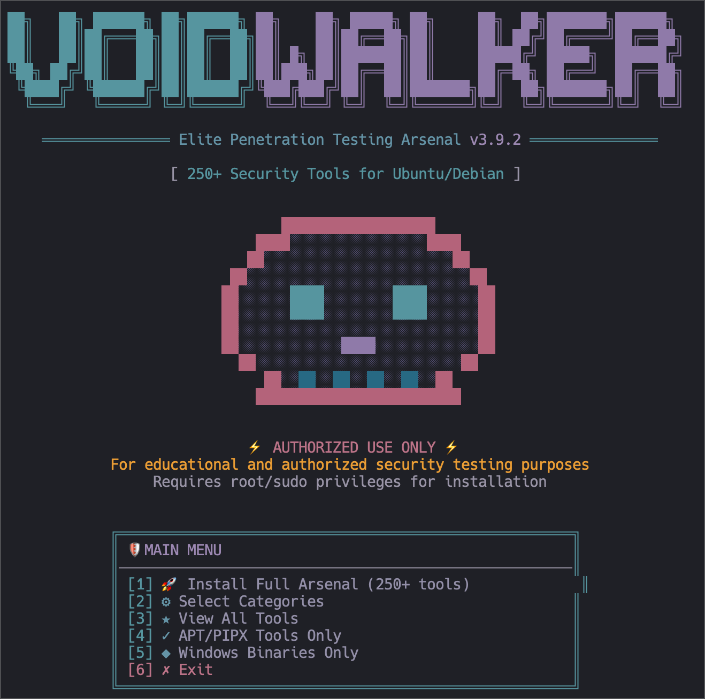

<div align="center">
  

  # V O I D W A L K E R
  **ELITE PENETRATION TESTING ARSENAL BUILDER & WORKSPACE MANAGER**

  [](https://github.com/DAEMON-404/voidwalker.py)
  [](https://github.com/DAEMON-404/voidwalker.py)
  [](https://github.com/DAEMON-404/voidwalker.py)
  [](https://github.com/DAEMON-404/voidwalker.py)
  [](https://github.com/DAEMON-404/voidwalker.py)
</div>

---

<br>

## ⚡ What is VoidWalker?
VoidWalker is an advanced, automated toolkit built for Red Teamers, Penetration Testers, and HTB Pro Lab players. It transforms a barebones macOS or Linux system into a fully equipped offensive workstation in minutes.

With **version 5.3.0**, VoidWalker is a clean, modular Python package with first-class **multi-architecture** support (x86_64 **and** ARM64/aarch64/armv7) — so it runs on Apple Silicon, Raspberry Pi, AWS Graviton and other ARM hardware, not just amd64.

**Version 5.3.0** folds two former standalone projects *into* VoidWalker so the whole workflow lives behind one command:

- 🐉 **Kali fixer (pimpmykali)** — the battle-tested "make a fresh Kali VM usable" engine, now reachable as `voidwalker kali …` and from the main menu. Fixes missing tooling, smb.conf, nmap scripts, Impacket, mirrors, root login and more.
- 🔐 **Pentest environment (pe)** — an encrypted, target-centric workspace for **flags, creds, hosts and notes** (SQLCipher), a VPN-aware HTB tmux workspace, Rose Pine GNOME/XFCE desktop setup, and an offline cyberpunk HTML handbook (`pe guide`), reachable as `voidwalker env` (deploy) and `voidwalker pe …` (use).

These aren't bolted-on scripts: the proven engines are vendored inside the `voidwalker` package and driven through VoidWalker's own themed UI and CLI — one package, one entry point.

### 🔥 Key Features
- 🧠 **Architecture-Aware Installs**: Detects the host CPU (`amd64` / `arm64` / `armv7`) and selects matching binaries. Host-native tools without an ARM build are routed to a from-source path (`go install` / `cargo install`) instead of installing an x86 binary that can't run. Transfer/payload binaries are fetched for **every** published OS+arch (including Windows ARM64) so you have something to drop on any target.
- 🚀 **Blazing Fast Engine**: Multi-threaded, parallel downloads utilizing Python's `ThreadPoolExecutor`. Skips existing files and automatically retries failed connections with exponential backoff.
- 🔨 **Automated C# Build Pipeline**: Clones and compiles custom C# offensive tools from source via `dotnet build -c Release`.
- 📓 **Obsidian Vault Scaffolding**: Instantly generates a structured, professional-grade engagement vault equipped with Dataview dashboards, templates (Hosts, Credentials, Findings), and dynamic attack cheatsheets.
- 🍏 **Cross-Platform Support**: Seamlessly installs dependencies via `apt-get` (Linux) or `brew` (macOS), configuring tools across operating systems.
- 🎨 **Switchable Themes**: A refreshed neon-cyberpunk palette by default, with `--theme rosepine` / `--theme matrix` alternates (or set `VOIDWALKER_THEME`).
- 🩺 **`--dry-run` & `selftest`**: Preview the exact per-architecture install plan without downloading anything, and validate the tool catalog offline.
- 🗄️ **Integrated References**: A curated repository of Maldev learning resources, commercial C2 frameworks, and offensive guides directly from the CLI.
- 🐳 **Dockerised Kali Box**: A headless, repeatable Kali container that replaces a Parallels VM — one `hbox build` bakes the lean HTB arsenal, the `pe` zsh/tmux environment, and an in-container HTB VPN. See [`docker/`](docker/README.md).

<br>

## 🛠️ The Arsenal
VoidWalker curates over 350 specialized tools across the following domains:

| Category | Description | Key Tools |
| :--- | :--- | :--- |
| **Windows Binaries** | Compiled C# AD recon, credential extraction, and lateral movement. | `Rubeus`, `Seatbelt`, `SharpHound`, `Certify`, `HandleKatz` |
| **C# Build Targets** | Automated source-to-binary compilation for OPSEC. | `ADCSPwn`, `SharpSCCM`, `GhostlyHollowing`, `SauronEye` |
| **Maldev & Evasion** | Custom loaders, sleep obfuscators, and shellcode runners. | `Freeze.rs`, `NimPlant`, `Ekko`, `CallStackMasker` |
| **C2 Frameworks** | Command and Control servers for post-exploitation. | `Havoc`, `Mythic`, `Sliver`, `Empire`, `Covenant` |
| **PowerShell** | Memory-resident scripts and AMSI bypasses. | `PowerSploit`, `Nishang`, `PowerView`, `Chimera` |
| **Cross-Platform** | Tunnels, proxies, and relays across OS boundaries. | `Chisel`, `Ligolo-ng`, `Kerbrute`, `Fscan` |

<br>

## ⚙️ Installation & Requirements

### Dependencies
- Python 3.8+ (standard library only — no pip dependencies to run)
- `git`
- `.NET SDK 8.0+` (Required for the C# compilation pipeline; arm64 SDK on ARM hosts — see `BUILD_GUIDE.md`)
- `brew` (macOS) or `apt` (Linux)

### Quick Start
```bash
# Clone the repository
git clone https://github.com/daemon-404/voidwalker.py.git
cd voidwalker.py

# Launch the interactive console (run straight from the checkout)
python3 voidwalker.py

# …or install it and use the `voidwalker` command / module form
pip install .
voidwalker            # same as python3 voidwalker.py
python3 -m voidwalker # module entry point

# See what WOULD be installed for THIS machine's architecture (no downloads)
python3 voidwalker.py --dry-run

# Validate the tool catalog offline
python3 voidwalker.py selftest
```

### Install with UV ⚡ (recommended)

[`uv`](https://github.com/astral-sh/uv) is the fast Rust-based Python manager
(and what VoidWalker itself uses to install some Python tools). Because
VoidWalker is a pure-stdlib package with a console entry point, `uv` makes it a
one-liner — no manual venv, and it works the same on x86_64 and ARM.

```bash
# Don't have uv yet? (works on Linux & macOS, amd64 + arm64)
curl -LsSf https://astral.sh/uv/install.sh | sh

# 1) Install the `voidwalker` command globally in an isolated environment
uv tool install .
voidwalker --dry-run
voidwalker selftest

# 2) …or run straight from the checkout without installing (uv manages the venv)
uv run voidwalker.py            # interactive menu
uv run voidwalker.py --dry-run  # per-arch install plan
uv run voidwalker.py poc CVE-2021-44228

# 3) …or run the entry point ephemerally with uvx (nothing left behind)
uvx --from . voidwalker --dry-run

# Pin a specific interpreter if you like (uv will fetch it for you)
uv run --python 3.11 voidwalker.py
```

> `uv tool install .` puts `voidwalker` on your PATH via `~/.local/bin`
> (run `uv tool update-shell` once if it isn't picked up). Upgrade later with
> `uv tool upgrade voidwalker`, or uninstall with `uv tool uninstall voidwalker`.

<br>

## 🖥️ Usage & Commands

Launch the **interactive cyberpunk TUI** directly by running `python3 voidwalker.py` to access the main menu:
```text
[1]  🚀 Install Full Arsenal (350+ tools)
[2]  ⚙️  Select Categories
[3]  ⭐ View All Tools
[4]  ✓  System Packages (apt/brew)
[5]  ⚡ Install Metasploit (msfconsole)
[6]  ⭐ Install AI Code Agents (claude / codex)
[7]  💎 Windows Binaries Only
[8]  ⚡ Build C# Tools from Source
[9]  🛡️  Setup Pentest Obsidian Vault
[10] ⚙️  Fix / Harden Kali (pimpmykali)
[11] 💎 Deploy Pentest Environment (pe)
[12] 🛡️  Setup BloodHound-CE
[13] ⚙️  Proxy / Pivot Helper
[14] ⭐ Engagement Logging / Evidence
[15] 🛡️  View Sources & Guides
[16] ❌ Exit
```

### CLI Search Helpers
VoidWalker includes built-in offline search modules:
```bash
python3 voidwalker.py poc CVE-2021-44228   # Search local PoC-in-GitHub databases
python3 voidwalker.py nse http             # Search Nmap scripts
python3 voidwalker.py shodan apache        # Shodan terminal query (needs SHODAN_API_KEY)
python3 voidwalker.py exploitdb wordpress  # Search Exploit-DB
python3 voidwalker.py dork                 # Interactive Google Dork generator
```

### Integrated Toolkits
The folded-in Kali fixer and pentest environment are driven straight from the
same CLI (global flags like `--theme` must come *before* the command; everything
after the command is passed through to the underlying engine).

> **Want a standalone `pe` command?** Run `voidwalker env` **once**. That runs the
> full pentest-env installer — it symlinks `pe` and `htb-session` to
> `~/.local/bin`, wires your `~/.zshrc` + `~/.tmux.conf` (prompt, tmux bar,
> VPN-aware helpers), installs the deps, and copies a searchable offline HTML handbook,
> and runs `pe init` for you. After that, open a new shell (`exec zsh`) and use
> `pe init`, `pe target add Cap --ip …` **directly — no `voidwalker` prefix**.
> The `voidwalker pe …` form is just a convenience that *also* works before you
> deploy (it falls back to the bundled copy, writing the same encrypted DB).

```bash
# 🐉 Kali fix / harden (pimpmykali) — self-elevates with sudo, Kali/Debian only
python3 voidwalker.py kali                  # curated submenu of common fixes
python3 voidwalker.py kali --newvm          # fresh-Kali setup (fix all)
python3 voidwalker.py kali --missing        # install the usual missing tooling
python3 voidwalker.py kali --nmap --smbconf # pass any pimpmykali switch through

# 🔐 Deploy the pentest environment (pe) — Linux & macOS
python3 voidwalker.py env                   # deploy submenu (full / core / dry-run / uninstall)
python3 voidwalker.py env --dry-run         # preview every action, change nothing
python3 voidwalker.py env --no-wm --no-theme  # core only (skip desktop theming + BSPWM)

# 🔐 Use the encrypted pe workspace (passthrough to the pe dispatcher)
python3 voidwalker.py pe init               # create + key the encrypted DB
python3 voidwalker.py pe target add Cap --ip 10.10.10.245
python3 voidwalker.py pe flag add user 'HTB{...}'
python3 voidwalker.py pe cheat env          # browse the in-terminal cheatsheets
python3 voidwalker.py pe guide              # open the Rose Pine Dawn HTML handbook
python3 voidwalker.py pe guide tmux         # open one dedicated app cheatsheet

# 🩸 BloodHound-CE: download the official bloodhound-cli binary from GitHub,
# auto-install Docker if missing, bring up the stack (Postgres+Neo4j+BloodHound),
# and print the admin password + first-run steps. Linux & macOS.
python3 voidwalker.py bloodhound             # guided submenu (install / start / stop / creds)
python3 voidwalker.py bloodhound containers up   # raw passthrough to bloodhound-cli
#   UI: http://localhost:8080  ·  user: admin  ·  pass: shown after install (config get)

# 🧦 Proxy / pivot: wire proxychains4 to a SOCKS pivot (writes ~/.proxychains/…)
python3 voidwalker.py proxy 127.0.0.1:1080   # then: proxychains4 nxc smb <target>
python3 voidwalker.py proxy                  # submenu (set proxy / show / pivot cheatsheet)

# 🎥 Engagement logging + evidence (audit trail into ~/voidwalker/engagements/<name>/)
python3 voidwalker.py rec shell HTB-Cap      # recorded shell (asciinema/script)
python3 voidwalker.py rec shot HTB-Cap       # screenshot into evidence/

# 🖥️ Parallels VM (Kali guest): install Parallels Tools, fixing the noexec
# mount + DKMS headers + libfuse2 rename. Attach the Tools CD first
# (Actions > Install Parallels Tools). Self-elevates — do NOT prefix sudo.
python3 voidwalker.py pt                     # unmount, remount exec, install
python3 voidwalker.py pt --mount-only        # just remount exec; run ./install yourself
```

<br>

## 🐳 Kali Docker Box (HTB)

A headless, repeatable Kali box for HackTheBox Academy / Labs / CTFs — a
drop-in replacement for a Parallels VM on macOS. It **reuses VoidWalker** as the
engine: the arch-aware downloader fetches the droppable arsenal, the package
lists drive apt/pipx/uv/go, and the `pentest-env` gives the same Rose Pine
zsh + tmux + encrypted `pe` workspace (minus the X11 rice, since it's headless).
`voidwalker`, `pe`, `poc`, `nse` all work inside the box.

```bash
cd docker && cp .env.example .env       # optional image/base settings
./bin/hbox build                        # ~20–40 min: bakes the lean HTB arsenal (native architecture)
./bin/hbox up && ./bin/hbox shell       # tmux session inside the box
./bin/hbox vpn up lab.ovpn              # the HTB VPN runs INSIDE the container
./bin/hbox verify                       # smoke-test the tools
```

Tools are baked into the image (repeatable build; run offline, `docker save`, or
push to a registry); your work, encrypted DB, and VPN configs live on volumes.
Run Burp Suite / Wireshark natively on macOS. Full docs, persistence and
portability: [`docker/README.md`](docker/README.md).

<br>

## 🧱 Project Structure

As of v5.3.0 the former single 4,000-line script is a modular package. The
top-level `voidwalker.py` is now a thin launcher, so existing usage is unchanged.

```text
voidwalker.py              # thin launcher shim (python3 voidwalker.py …)
pyproject.toml             # packaging + `voidwalker` console entry point
voidwalker/
├── cli.py                 # argument parsing & dispatch (+ --dry-run, --theme, selftest)
├── hostinfo.py            # OS + CPU architecture detection / asset selection
├── theme.py               # colour palettes (voidwalker / rosepine / matrix)
├── ui.py                  # banners, menus, animations, progress widgets
├── download.py            # download / extract / subprocess helpers
├── installers.py          # apt / brew / uv / go / cargo / gem / dotnet installers
├── xplat.py               # architecture-aware binary installation
├── vault.py               # Obsidian engagement-vault scaffolding
├── search.py              # poc / nse / exploitdb / shodan / dork helpers
├── selftest.py            # offline catalog + integration validation
├── data/                  # the catalog (data separated from logic)
│   ├── catalog.py         # TOOL_CATEGORIES
│   ├── packages.py        # apt/brew/pipx/uv/go/cargo/gem lists
│   ├── binaries.py        # arch-aware (os, arch) → assets map
│   ├── build_targets.py   # C# build targets
│   ├── sources.py         # reference links & guides
│   └── workspace.py       # engagement directory scaffold
└── integrations/          # toolkits folded into VoidWalker
    ├── kali.py            # pimpmykali wrapper   (voidwalker kali)
    ├── penv.py            # pentest-env wrapper  (voidwalker env / pe / pt)
    ├── bloodhound.py      # BloodHound-CE setup  (voidwalker bloodhound)
    └── assets/            # vendored upstream engines (shipped as package data)
        ├── pimpmykali/    # pimpmykali.sh + nmap nse fix
        └── pentest-env/   # install.sh + pe config + offline HTML field manual

docker/                    # Kali HTB container — headless, repeatable
├── Dockerfile             # layered multi-arch build; reuses voidwalker as installer + env
├── provision.py           # DRY driver over voidwalker's catalog + arch-aware downloader
├── docker-compose.yml     # NET_ADMIN + /dev/net/tun so the HTB VPN runs in-container
├── entrypoint.sh          # first-run: tun device, dirs, defers interactive `pe init`
├── bin/hbox               # host wrapper: build / up / shell / vpn / verify / save
└── config/                # container zsh + tmux tweaks + the `htb` VPN helper
```

### 🖥️ Supported architectures

| OS | amd64 (x86_64) | arm64 / aarch64 | armv7 (32-bit) |
| :--- | :---: | :---: | :---: |
| **Linux** | ✅ | ✅ | ✅ (from-source fallback where no prebuilt binary) |
| **macOS** | ✅ | ✅ (Apple Silicon) | — |
| **Windows targets** | ✅ | ✅ (ARM64 transfer binaries where upstream ships them) | — |

`python3 voidwalker.py --dry-run` prints the resolved plan for the host you're on.

## 📓 Obsidian Vault Structure
Running the `[9] Setup Pentest Obsidian Vault` option scaffolds the following engagement template directly into your `~/voidwalker/Vault` directory:

```text
~/voidwalker/Vault/
├── 01_Admin/          (Rules of Engagement, Scope, Configs)
├── 02_Recon/          (OSINT, Nmap Scans, AD enumeration)
├── 03_Hosts/          (Individual Host templates via Dataview)
├── 04_Credentials/    (Hashes, Kerberos tickets, cleartext)
├── 05_Findings/       (Vulnerabilities mapped to CVSS)
├── 06_Payloads/       (Compiled binaries, webshells, scripts)
├── Cheatsheets/       (AD Attacks, File Transfers, Reverse Shells, etc.)
└── Dashboard.md       (Live Dataview engagement tracking)
```

<br>

## ⚠️ Disclaimer
**AUTHORIZED USE ONLY.** VoidWalker is designed strictly for educational purposes, authorized security testing, and Red Team operations. 

- **DO** use on authorized targets only.
- **DO NOT** run on production systems without explicit consent.
- **DO NOT** commit the downloaded tool cache into Git.

The authors are not responsible for any misuse, damage, or illegal activities caused by this tool.
